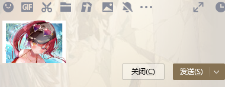
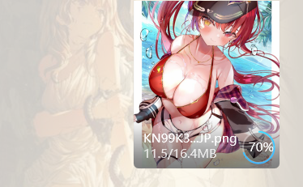
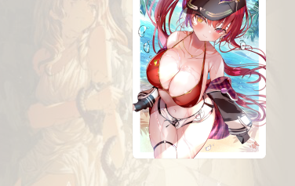

# Img-Resize

## 联动项目

[Pix-Random-Change](https://github.com/LanluZ/Pix-Random-Change):修改剪贴板内图像像素点，在几乎不影响原图的情况下，改变图像原有哈希值

## 说明

读取剪贴板内图片，将大小缩小到合适范围后，再将图片写入到剪贴板

## 下载

https://github.com/LanluZ/Img-Resize/releases/tag/1.0

## 使用

1. 复制图片到剪贴板
2. 运行程序等待执行完毕
3. 粘贴后的图片即为修改后的图片

## 使用案例

### QQ

由于QQ会将过大的图片当做文件上传，所以使用此程序缩小剪贴板图片大小

**图像来源于网络，侵删**

运行前：

运行后：

